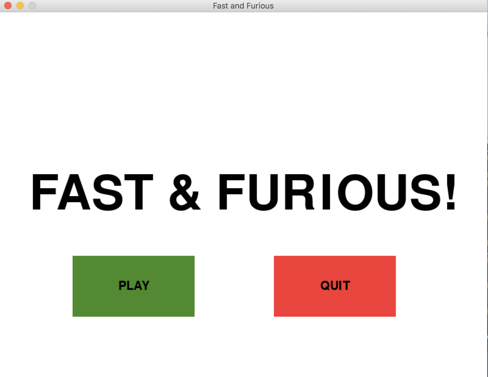
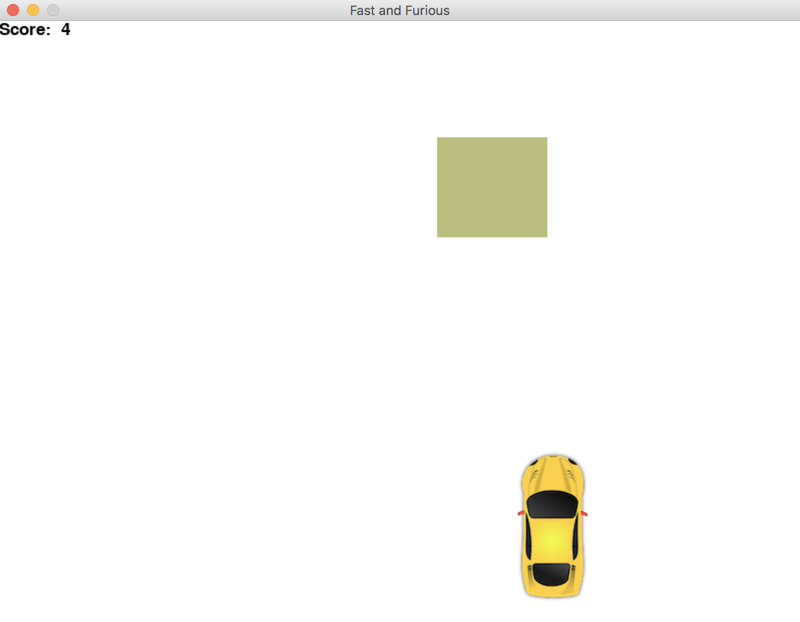
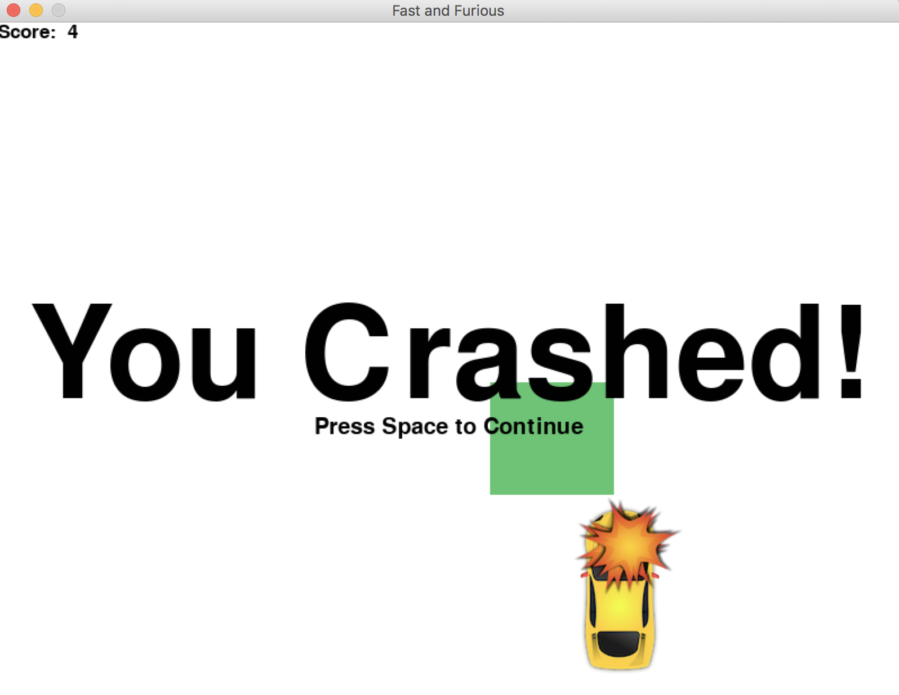

# Python_Projects
A repository of small python projects that were built in order to learn the basics of the language

## Race Game
A 2D race game which was implemented using the pygame library. 
The game allows the user to control a small race car to avoid obstacles falling horizontally.
As such, the user uses the left and right key buttons to move left or right and avoid obstacles.
The game gets progressively harder as the obstacles fall at a faster pace and become wider
### Some Gameplay Screenshots :

## Race Game
A 3D cube runner game which was built using pygame and openGL. The cubes approach the player from all sides 
and there is no bounded limit as to where the user can move.

## Tic Tac Toe Game
A simple Tic Tac Toe game that can be played in the console/terminal using Python3

