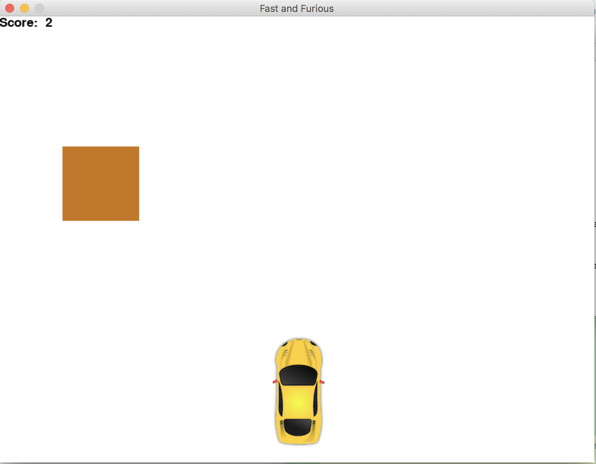
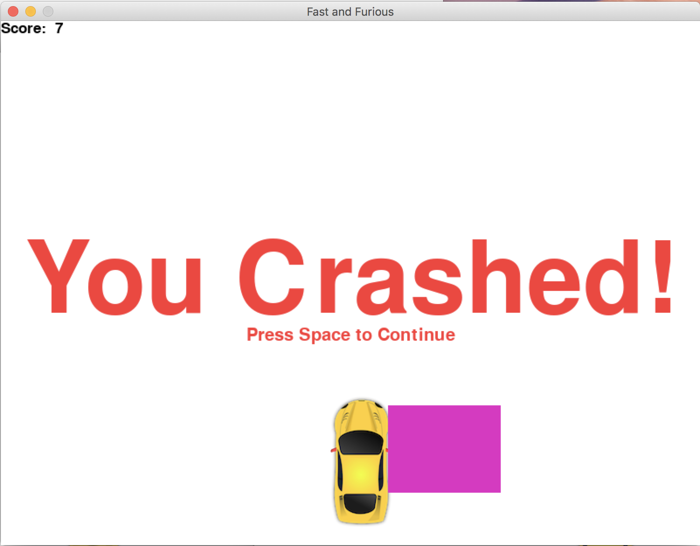

# Python_Projects
A repository of small python projects that were built in order to learn the basics of the language

## Race Game
A 2D race game which was implemented using the pygame library. 
The game allows the user to control a small race car to avoid obstacles falling horizontally.
As such, the user uses the left and right key buttons to move left or right and avoid obstacles.
The game gets progressively harder as the obstacles fall at a faster pace and become wider
### Some Gameplay Screenshots :

## Tic Tac Toe Game
A simple Tic Tac Toe game that can be played in the console/terminal using Python3

